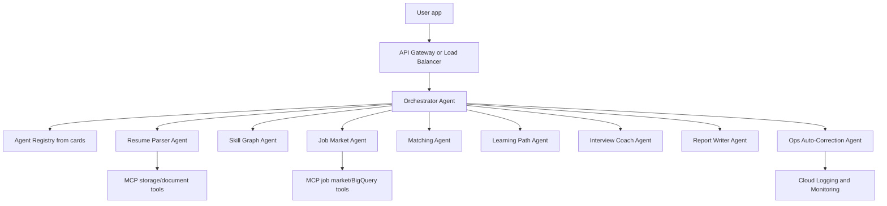

# Architecture

SkillBridge AI uses a main orchestrator plus specialist agents. Every agent is a separately
deployable Cloud Run service with an A2A-style Agent Card and a single task API.

## Boundaries

- A2A is used for agent-to-agent task delegation.
- MCP is used for agent-to-tool and agent-to-data access.
- The orchestrator should not directly access specialist data tools unless there is a product
  reason to make that capability part of orchestration.
- Each agent should get its own service account in production.

## Agent Contract

Each service exposes:

- `GET /healthz`
- `GET /.well-known/agent-card.json`
- `POST /tasks`

`POST /tasks` accepts `TaskRequest` and returns `TaskResponse` from
`packages/skillbridge_common/schemas.py`.

## Operations Auto-Correction

The ops agent diagnoses alerts and proposes actions. Low-risk actions can be automated later.
Medium and high-risk actions should flow through approval.

Initial safe actions:

- open an incident ticket
- switch to a fallback model
- pause queue consumers
- roll back Cloud Run traffic after approval
- create a configuration PR

Blocked without approval:

- IAM changes
- secret changes
- deleting data
- production database migrations
- user-impacting recommendation policy changes

